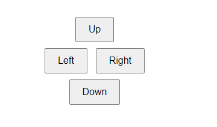
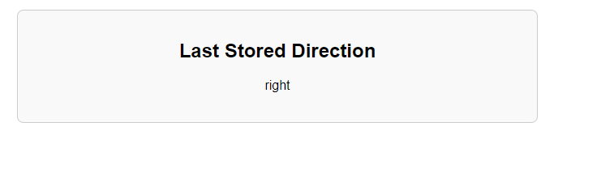

# Robot Control Panel

This project is a simple robot control panel built using PHP and HTML, which allows users to send directional commands (up, down, left, right) and view the last stored direction. The control panel communicates with a MySQL database to store and retrieve directions, and it only stores the last two directions sent.

## Usage

1. Start your local server (Xampp)
2. Open `Cpanel.html` in your browser to access the control panel.
3. Use the buttons to send directional commands.
4. Open `last_direction.php` in your browser to view the last stored direction.

## Files

- **conn.php**: Contains the database connection details.
  
- **Cpanel.html**:  user interface for sending directional commands.
  
- **last_direction.php**: Displays the last stored direction.
  
- **save_direction.php**: Handles storing the directions in the database and ensures only the last two directions are stored.

## Screenshots

### Control Panel

### Last Stored Direction

